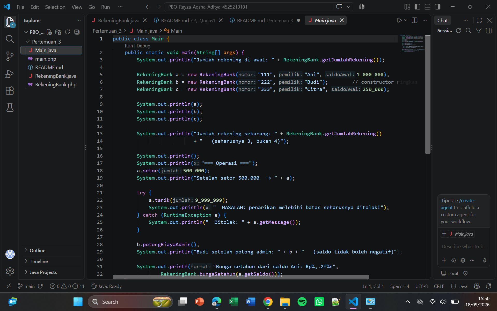
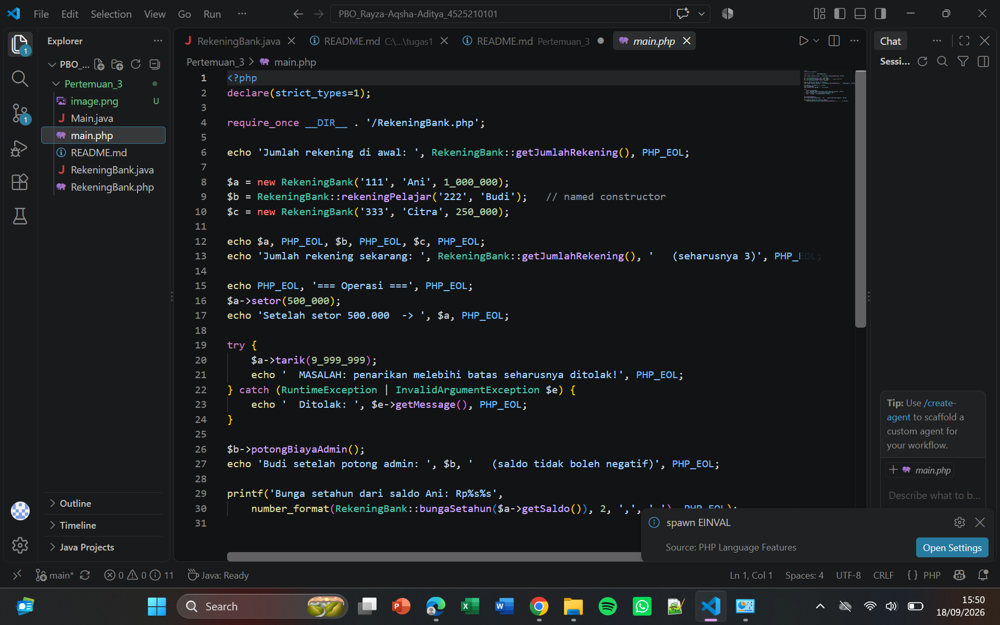
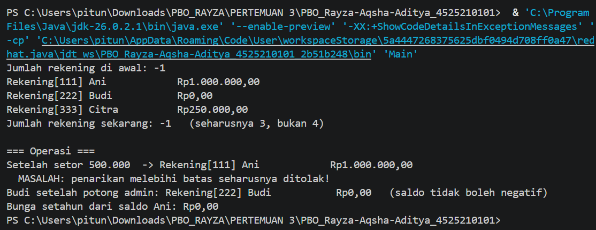
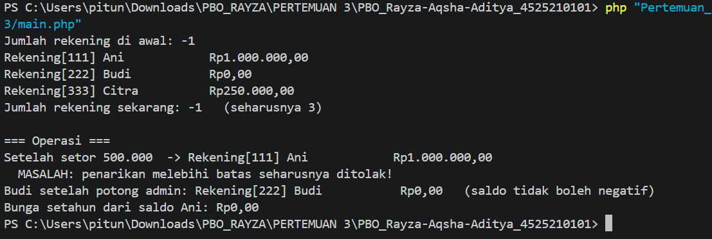

# Sesi 3 — Constructor Berdelegasi, Anggota Statis, dan Konstanta: Rekening Bank

## Nama Domain
**Rekening Bank** — mencatat data rekening nasabah dan mengelola saldonya (setoran, penarikan, bunga tahunan, dan biaya administrasi).

## Cara Kerja Sederhana

Bayangkan class `RekeningBank` seperti buku tabungan fisik. Setiap buku tabungan punya nomor rekening yang tidak pernah berubah, nama pemilik, dan saldo yang bisa naik-turun lewat transaksi yang tercatat.

1. **Dua constructor, satu sumber kebenaran** — `RekeningBank` punya constructor ringkas `RekeningBank(nomor, pemilik)` untuk rekening baru bersaldo nol, dan constructor lengkap `RekeningBank(nomor, pemilik, saldoAwal)` untuk rekening dengan setoran awal. Constructor ringkas **tidak** menyalin ulang logika validasi — ia mendelegasikan ke constructor lengkap lewat `this(nomor, pemilik, 0)`. Dengan begitu, hanya ada satu tempat yang menjaga aturan pembuatan objek, dan constructor ringkas otomatis ikut aman kalau aturan itu berubah di kemudian hari.

2. **Konstanta menggantikan angka ajaib** — Nilai seperti bunga tahunan (0.025), biaya administrasi (5000), dan batas penarikan sekali (5.000.000) dideklarasikan sebagai `public static final` bernama, bukan ditulis langsung di badan method. Ini membuat maksud angka tersebut jelas dibaca, dan kalau kebijakan bank berubah, cukup diubah di satu tempat.

3. **Anggota statis melacak seluruh objek** — Selain data per-rekening (nomor, pemilik, saldo), class ini juga punya field statis privat yang menghitung total jumlah rekening yang pernah dibuat. Field ini bernilai awal 0, dan bertambah setiap kali constructor lengkap dipanggil — karena field statis milik class, bukan milik satu objek, nilainya dibagi oleh semua rekening.

4. **Transaksi tetap dijaga lewat method, bukan setter bebas** — `setor(jumlah)` dan `tarik(jumlah)` memastikan jumlah transaksi selalu positif, dan `tarik()` menolak permintaan yang melebihi batas penarikan sekali (dilempar sebagai `RuntimeException`/`InvalidArgumentException` agar program pemanggil bisa menangkap dan menampilkan pesan, tanpa saldo sempat berubah). `potongBiayaAdmin()` mengurangi saldo dengan biaya admin tetap, dan `bungaSetahun(saldo)` dihitung sebagai method statis karena perhitungannya tidak bergantung pada satu objek tertentu — cukup diberi angka saldo, hasilnya bisa dihitung.

5. **Versi PHP sebagai pembanding** — `main.php` menunjukkan pola yang sama dengan gaya PHP: constructor biasa `new RekeningBank(...)` untuk kasus umum, dan *named constructor* statis `RekeningBank::rekeningPelajar(...)` sebagai cara alternatif membuat objek dengan aturan/nama yang lebih deskriptif — konsep yang sejalan dengan constructor delegation di Java.

Singkatnya: aturan pembuatan dan perubahan data `RekeningBank` dijaga di dalam class itu sendiri lewat constructor delegation, konstanta bernama, dan method transaksi. Program pemanggil (`Main.java` / `main.php`) tinggal memanggil method-nya dan menangani penolakan kalau transaksi tidak valid.

## Invarian & Alasannya

1. **Saldo tidak pernah negatif.**
   Saldo mewakili uang nyata milik nasabah. Nilai negatif tidak punya makna dan akan merusak logika transaksi berikutnya (bunga, biaya admin, penarikan).

2. **Nomor rekening tidak berubah setelah objek dibuat.**
   Nomor rekening adalah identitas unik nasabah. Kalau bisa diubah setelah rekening dibuat, catatan transaksi lama bisa jadi merujuk ke identitas yang salah.

3. **Setoran dan penarikan selalu bernilai positif.**
   Transaksi bernilai nol atau negatif tidak masuk akal secara bisnis, dan bisa dipakai untuk menyelinapkan perubahan saldo yang tidak sah (misalnya "menarik" jumlah negatif yang sebenarnya menambah saldo).

Ketiga invarian ini ditegakkan di dalam class `RekeningBank`, bukan di `Main`/`main.php`:
- Invarian 1 dan 3 dicek di constructor lengkap serta di method `setor()` dan `tarik()`.
- Invarian 2 dijaga dengan mendeklarasikan `nomor` sebagai `final` (Java) / `readonly` (PHP) — tidak ada setter untuk field ini.
- Tidak ada setter bebas untuk `saldo` — satu-satunya cara mengubahnya adalah lewat `setor()`, `tarik()`, `potongBiayaAdmin()`, yang semuanya menjaga invarian di atas.
- Angka ajaib (bunga, biaya admin, batas penarikan) dipindahkan ke konstanta `public static final` agar aturan bisnis mudah ditelusuri dan diubah di satu tempat, bukan tersebar di banyak baris kode.

## Deklarasi Penggunaan AI

Bagian struktur kode (class `RekeningBank`, `Main`, dan `main.php`) disusun dengan bantuan Claude (Anthropic), mengikuti pola dan ketentuan yang diberikan pada materi Pertemuan 3 (constructor berdelegasi, anggota statis, dan konstanta) sebagai referensi gaya penulisan. Pengisian TODO (konstanta bernama, field statis penghitung rekening, dan delegasi constructor), serta verifikasi akhir (compile & run), tetap harus dilakukan/diverifikasi oleh mahasiswa sendiri sebelum commit.

